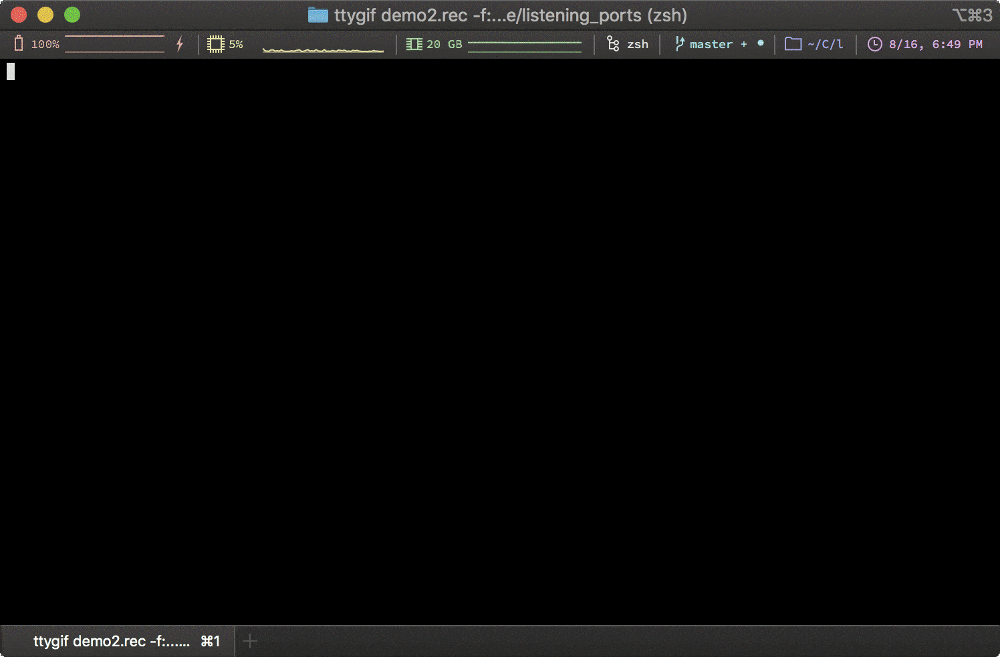

# listening_ports



macOS shell utility to list colorfully show what processes are listening on what ports. The intent of this program is to perform the same function typically accomplished by the command `netstat -natp`. This command is not possible on macOS operating systems (specifically the `-p` part), so this utility uses `lsof` and to get and print the same information, with some fancy terminal coloring and filtering features.

## Requirements

I'm going to assume you're using macOS and Homebrew. Those are pretty default tools these days. Here are some unique other dependencies and some info on how to install them.

### GNU `sed`

macOS ships with the most god awful version of `sed`. You can install a better version with Homebrew:

```sh
brew install gnu-sed
ln -sfv /usr/local/bin/gsed /usr/local/bin/sed
```

The second part is important because Homebrew will install it as `gsed` instead of `sed`. Fuck the macOS sed. Stop using it, just make this the default `sed` in the path.

*Tested Version: **4.7***

### `bash`

Just like with `sed`, the version of `bash` shipped with macOS is terrible. Install a better version with Homebrew and stop using the other.

```sh
brew install bash
```

No further configuration is required, but it's important to note that `listening_ports` uses a hardcoded shebang of `#!/usr/local/bin/bash` instead of the usual `#!/usr/local/env bash`. The reason for this is because when you run this with `sudo`, the `root` account's path typically doesn't have `env` shebang support in the same way you do. Saves trouble.

*Tested Version: **5.0.7***

### GNU `awk`

Yet again, terrible version, and not the same as GNU's supported version (`gawk`). Let's install it:

```sh
brew install gawk
```

*Tested Version: **5.0.0***

### `grc`

`grc` is an interesting utility to do generic colorization of various shell commands. Instead of following convention and rolling my own shell command colorized output, I decided to piggy bag off this fine product. To install it:

```sh
brew install grc
```

There's a lot more you can do with `grc` to colorize the output of commands, but I'll leave you to do that on your own time.

*Tested Version: **1.11.3***

## Installation

I don't have a package installer currently, but it's fairly simple to install this. Here's the basic commands:

```sh
# Install dependencies
brew install gnu-sed bash gawk grc

# Link GNU sed to the primary sed
[ -f "/usr/local/bin/sed" ] || ln -sfv /usr/local/bin/gsed /usr/local/bin/sed

# Clone the repo
git clone git@github.com:gen0cide/listening_ports.git
cd listening_ports

# Copy the colorized output to GRC's shared folder.
cp lib/conf.listening_ports "$(brew --prefix grc)/share/grc/conf.listening_ports"

# Copy the script and set the permissions.
cp listening_ports.bash /usr/local/bin/listening_ports
chmod +x /usr/local/bin/listening_ports
```

## Usage

The program is simple, but there's some options to filter and customize your output. Below is the program help menu:

```text
NAME:
  listening_ports - macOS utility to show what processes are listening on which ports.

USAGE:
  listening_ports [OPTIONS]

VERSION:
  1.0.0

DESCRIPTION:
  The intent of this program is to perform the same function typically accomplished by the command 'netstat -natp'. This command is not possible on macOS operating systems (specifically the '-p' part), so this utility uses 'lsof' and to get and print the same information, with some fancy terminal coloring and filtering features.

AUTHOR:
  Alex Levinson <alexl@uber.com>

WEBSITE:
  https://github.com/gen0cide/listening_ports

OPTIONS:
  -o, --protocol         What type of sockets to display. Acceptable values: tcp, udp, all. (default: 'tcp')
  -u, --user             Filter the results for a specific user. This can be a regular expression.
  -d, --process-id       Only show results for a specified process ID.
  -a, --process-name     Only show results for a processes that match the provided term. This can be a regular expression.
  -p, --port             Filter the results for a specific port number.
  -i, --ip-version       Only include results for a ports bound to a specific IP version. Acceptable values: ipv4, ipv6, both. (default: 'both')
      --hide-local       Do not display ports that are only bound to local interfaces.
  -v, --version          Prints version information.
  -h, --help             Prints the help menu.

COPYRIGHT:
  (c) Copyright 2019 Alex Levinson
```

## Shoutouts

- javuto
- cmc
- 1jection
- deadmau5
- hecfblog
- vyrus001
